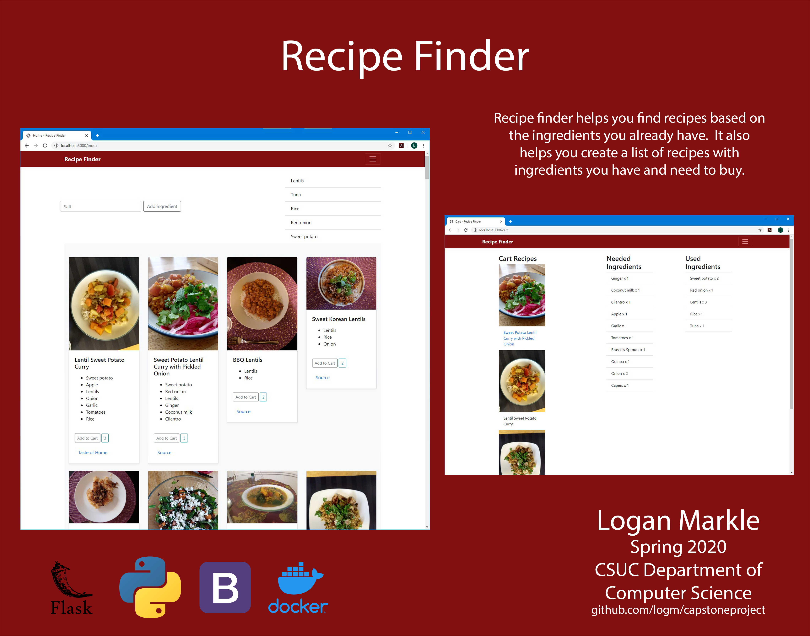

# CapstoneProject - Recipe Finder
## Logan Markle

This project will help you find a recipe with ingredients you already have.

* Input ingredients you have
* See a list of recipes that are similar to your existing ingredients
	* Each of these results will give you a list of ingredients you have which are needed and a list of ingredients you will need to buy
	* Eventually if given enough time in the semester I would like to add prices of the needed recipes
* Add several recipes to your "cart" and will give you a list of ingredients to buy
* This website should show all recipes until you start inputing ingredients

I am planning to do this project in Flask, found [this tutorial](https://blog.miguelgrinberg.com/post/the-flask-mega-tutorial-part-i-hello-world)

Timeline:
* 2/10 Finish Flask Tutorial(simple website and db setup) and find/combine recipes into one table
* 2/24 Basics website design with static content
* 3/16 DB/Dynamic content
* 4/6 Search
* 4/27 "Shopping cart" with recipe/ingredient list
* 5/8 Fixes and testing

<!-- Halfway Presentation
https://docs.google.com/presentation/d/1lalQ-8ZaXOop_yhecGfaWOaFA7PQWY40FiwMpUTV7pU/edit?usp=sharing -->

[Halfway Presentation ](https://docs.google.com/presentation/d/1lalQ-8ZaXOop_yhecGfaWOaFA7PQWY40FiwMpUTV7pU/edit?usp=sharing )

[Final Presentation ](https://docs.google.com/presentation/d/1Sa8yF7cJFmGzDZtNSlsXnIq3v31vbJ-nfaNM0uzQwiw/edit?usp=sharing )
